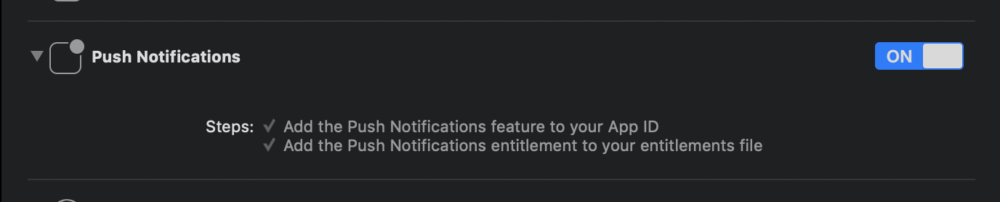

# notification_reactor 

For DIY engineers! Define your own reaction by Push Notification (via APNs (iOS) / FirebaseCloudMessaging (Android)).

## Getting Started

### Android Integration

To integrate your plugin into the Android part of your app, setup Firebase:

1. Using the [Firebase Console](https://console.firebase.google.com/) add an Android app to your project:
Follow the assistant, download the generated `google-services.json` file and place it inside `android/app`.
2. Modify the `android/build.gradle` file and the `android/app/build.gradle` file to add the Google services plugin as described by the Firebase assistant.
3. Implement your original `FirebaseMessagingService` in Java/Kotlin. Recommending to create your [`NotificationCompat`](https://developer.android.com/reference/android/support/v4/app/NotificationCompat) using [`support-compat`](https://developer.android.com/topic/libraries/support-library/packages#v4-compat). When you make `Notification` with `PendingIntent`, you should contains `RemoteMessage` object you received with key `"EXTRA_PUSH_MESSAGE"`.

```java
@Override
public void onMessageReceived(RemoteMessage remoteMessage) {
    Intent launchApp = new Intent();
    launchApp.putExtra("EXTRA_PUSH_MESSAGE", remoteMessage);
    launchApp.setClass(this, MainActivity.class);
    PendingIntent onTapNotification = PendingIntent.getActivity(this, 0, launchApp, PendingIntent.FLAG_ONE_SHOT);

    ...

    NotificationBuilder builder = (new NotificationCompat.Builder(...))
            .setContentIntent(onTapNotification);

    ...
}
```

(Please see [this tutorial](https://firebase.google.com/docs/android/setup) if you want.)

### iOS Integration

To integrate your plugin into the iOS part of your app, follow these steps:

1. Generate the certificates from [Apple developer center](https://developer.apple.com/account) for receiving push notifications. (Please see [this article](https://medium.com/@ankushaggarwal/generate-apns-certificate-for-ios-push-notifications-85e4a917d522) if you want the tutorial.)
2. Enable `Push Notification` in `Capabilities` tab in Xcode opening your `ios/Runner.xcworkspace`. 



### Dart/Flutter Integration

From your Dart code, you need to import the plugin and instantiate it:

```dart
import 'package:notification_reactor/notification_reactor.dart';

final reactor = NotificationReactor();
```

To set handler for Push Notifications, call `setHandlers()` :

```dart
reactor.setHandlers(
  onLaunch: (Map<String, dynamic> message) { /* Called when your app launched by PushNotifications */ },
  onResume: (Map<String, dynamic> message) { /* Called when your app become foreground from background by PushNotifications */ },
  onMessage: (Map<String, dynamic> message) { /* Called when receive PushNotifications during your app is on foreground */ },
);
```

... and send pushes from your server!

When you send pushes, you need APNs/FCM push token. To get token, recommending to use [plain_notification_token](https://pub.dev/packages/plain_notification_token).
